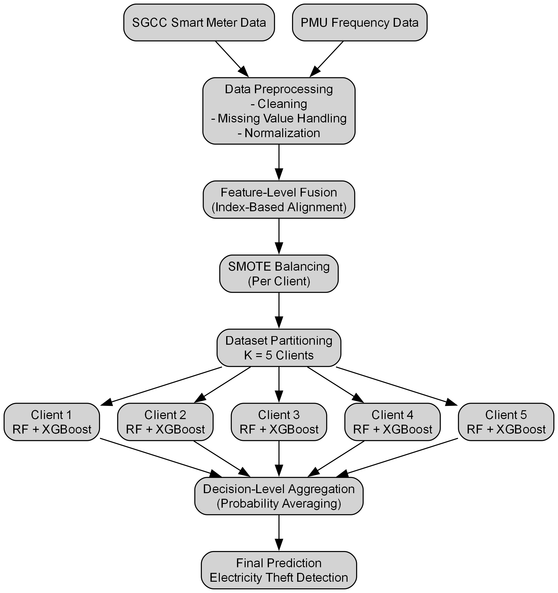
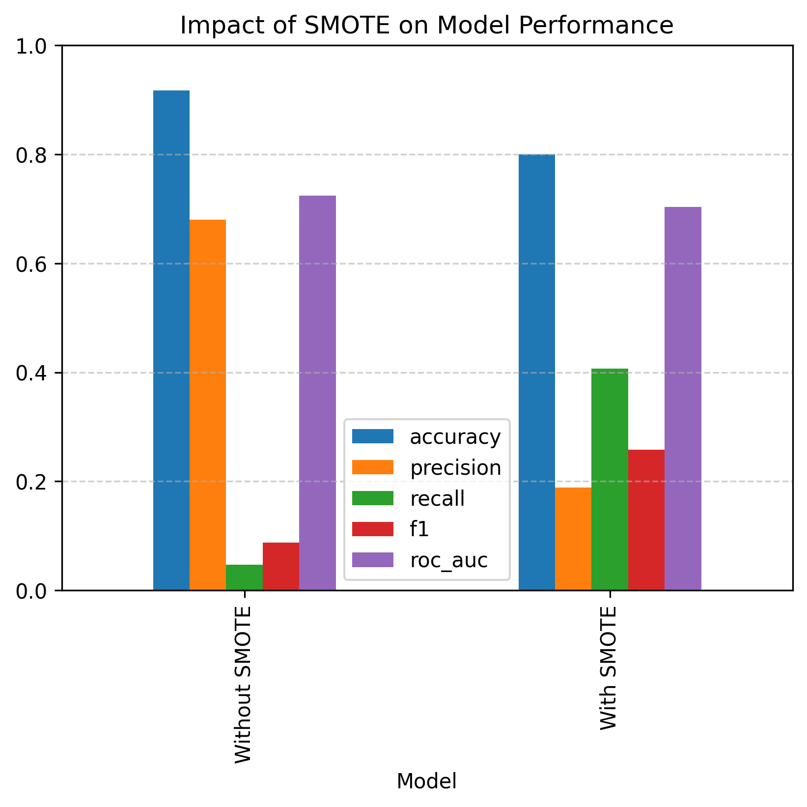
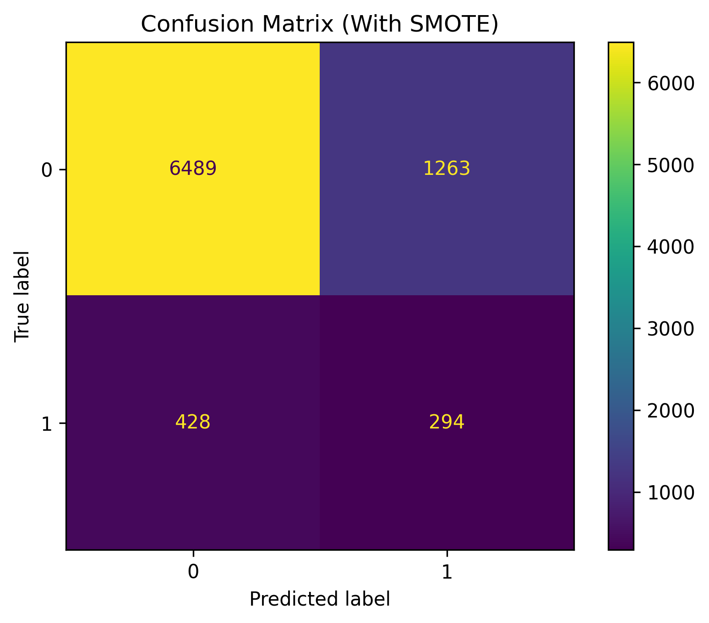
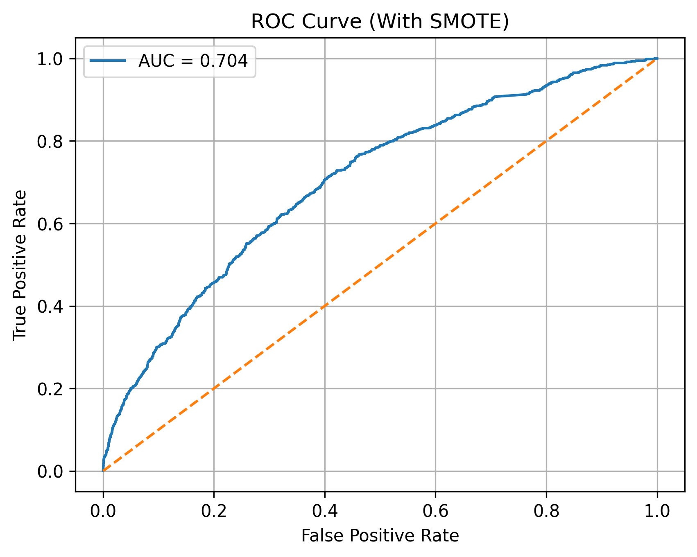

# Privacy-Preserving Electricity Theft Detection Using Federated Learning Simulation and Hybrid Ensemble Learning


---

## Overview

Electricity theft poses a significant challenge to modern smart grids, resulting in financial losses, reduced grid reliability, and operational inefficiencies. Conventional centralized machine learning approaches require the collection of customer data at a single location, raising concerns regarding privacy and data security.

This repository presents a privacy-preserving electricity theft detection framework that combines Federated Learning Simulation with a hybrid Random Forest and XGBoost ensemble. Synthetic Minority Oversampling Technique (SMOTE) is incorporated to address class imbalance, while feature fusion integrates consumer electricity consumption with power system frequency measurements to improve detection performance.

The proposed framework demonstrates that distributed machine learning can achieve competitive electricity theft detection performance while reducing the need to share raw consumer data.

## Research Contributions

The main contributions of this work are:

- Development of a privacy-preserving electricity theft detection framework using Federated Learning Simulation.

- Integration of smart meter consumption patterns with power system frequency measurements through multi-source feature fusion.

- Implementation of a hybrid ensemble model combining Random Forest and XGBoost classifiers for improved classification performance.

- Application of SMOTE-based class balancing to address the highly imbalanced nature of electricity theft datasets.

- Evaluation of centralized and distributed learning approaches to investigate the impact of privacy-preserving machine learning in smart grid cybersecurity applications.


---

## Methodology

The proposed framework follows a multi-stage machine learning pipeline:



```

The framework consists of the following stages:

### 1. Feature Fusion

Smart meter electricity consumption features are combined with PMU frequency measurements to capture both consumer behaviour and grid-level characteristics.

### 2. Data Balancing

SMOTE is applied only on the training data to improve minority class detection and reduce bias towards normal electricity consumption patterns.

### 3. Hybrid Machine Learning Model

Two supervised learning algorithms are employed:

- Random Forest
- XGBoost

The final prediction is generated through probability-based ensemble averaging.

### 4. Federated Learning Simulation

The training dataset is distributed among multiple simulated clients. Each client performs local model training, while only prediction information is aggregated, demonstrating a privacy-preserving learning approach.

### 5. Evaluation

Performance is assessed using:

- Accuracy
- Precision
- Recall
- F1-score
- ROC-AUC
- Confusion Matrix
- ROC Curve


---

## Dataset

The proposed framework uses two complementary data sources to perform electricity theft detection:

### 1. SGCC Smart Meter Dataset

The State Grid Corporation of China (SGCC) smart meter dataset contains electricity consumption records from residential consumers together with theft labels.

The dataset provides consumer-level behavioural information required for identifying abnormal electricity usage patterns.

### 2. PMU Frequency Dataset

A power system frequency dataset is incorporated to provide grid-level dynamic information.

Frequency measurements from Phasor Measurement Unit (PMU) data are combined with smart meter features to improve the representation of electricity theft events.

### Feature Fusion

The two datasets are integrated through feature-level fusion:

- Smart meter consumption features
- Grid frequency measurements

This multi-source approach enables the model to consider both customer behaviour and power system conditions during theft detection.

### Data Availability

Due to dataset licensing restrictions, the raw datasets are not included in this repository.

To reproduce the experiments, place the following files inside the `data` directory:

```
data/
│
├── sgcc_ml_ready.csv
└── merged_frequency_data.csv
```


---

## Installation

Clone this repository:

```bash
git clone https://github.com/vpthesizzler/Federated-Electricity-Theft-Detection.git
```

Navigate to the project directory:

```bash
cd Federated-Electricity-Theft-Detection
```

Install the required dependencies:

```bash
pip install -r requirements.txt
```

### Requirements

The framework was developed using:

- Python 3.10
- NumPy
- Pandas
- Scikit-learn
- XGBoost
- Imbalanced-learn
- Matplotlib


---

## Experimental Results

The proposed framework was evaluated using a hybrid ensemble of Random Forest and XGBoost classifiers. SMOTE was applied to the training data to improve minority class detection performance.

### Performance Comparison

| Model | Accuracy | Precision | Recall | F1-score | ROC-AUC |
|---|---|---|---|---|---|
| Hybrid Ensemble without SMOTE | - | - | - | - | - |
| Hybrid Ensemble with SMOTE | - | - | - | - | - |

The complete numerical results are available in:

```
results/tables/smote_comparison.csv
```

### Visual Results

#### SMOTE Performance Comparison



#### Confusion Matrix



#### ROC Curve




